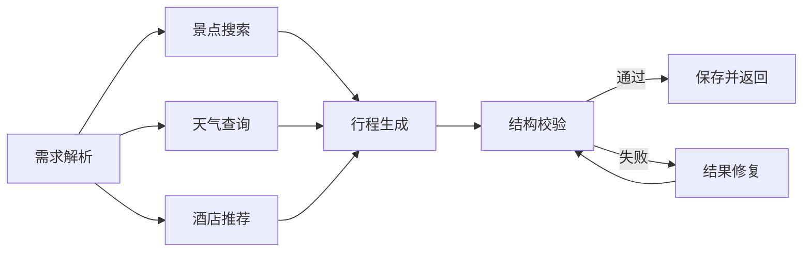

# TripMind 智能旅行规划系统

TripMind 是一个面向毕业设计和本地演示的智能旅行规划 Web 系统。系统采用前后端分离架构，后端使用 FastAPI、LangGraph、LangChain 和 SQLAlchemy，前端使用 Vue3、TypeScript、Vite 和 Ant Design Vue。它不是单次调用大模型的 Demo，而是包含用户认证、数据库持久化、异步任务、多 Agent 工作流、地图服务和管理后台的完整应用。

## 核心功能

- 用户认证：注册、登录、JWT 鉴权、个人资料维护。
- 权限区分：普通注册账号默认为普通用户，默认管理员由环境变量初始化，普通用户无法进入后台。
- 智能规划：根据城市、日期、交通、住宿、偏好和补充需求生成结构化行程。
- 多 Agent 工作流：需求解析、景点搜索、天气查询、酒店推荐、行程生成、结构校验、结果修复。
- 异步任务：行程生成通过任务 ID 轮询进度，避免长时间阻塞前端。
- 数据沉淀：历史行程、收藏地点、用户偏好、任务日志全部保存到数据库。
- 地图能力：POI 探索、路线规划、天气查询、结果页地图标注和路线折线。
- 结果编辑：支持景点删除、排序、字段编辑、PNG/PDF 导出。
- 管理后台：用户列表、任务日志、成功率、近 7 天任务、热门目的地统计。

## 技术栈

| 层级 | 技术 |
| --- | --- |
| 前端 | Vue3、TypeScript、Vite、Ant Design Vue、Axios、AMap JS API |
| 后端 | FastAPI、Pydantic、SQLAlchemy、SQLite、JWT |
| AI 编排 | LangGraph、LangChain、OpenAI 兼容模型接口 |
| 外部服务 | 高德地图 REST API、Unsplash 图片服务 |
| 导出 | html2canvas、jsPDF |

## 项目结构

```text
intelligent-trip-planner/
├── backend/
│   ├── app/
│   │   ├── agents/              # LangGraph 多 Agent 工作流
│   │   ├── api/routes/          # FastAPI 路由
│   │   ├── models/              # Pydantic 请求/响应模型
│   │   ├── services/            # LLM、地图、图片服务封装
│   │   ├── tools/               # LangChain 工具
│   │   ├── auth.py              # JWT、密码哈希、当前用户
│   │   ├── database.py          # 数据库连接和 Session
│   │   └── db_models.py         # SQLAlchemy ORM 模型
│   ├── requirements.txt
│   └── .env.example
├── frontend/
│   ├── src/
│   │   ├── services/            # API 请求封装
│   │   ├── styles/              # 全局样式
│   │   ├── types/               # TypeScript 类型
│   │   └── views/               # 页面视图
│   ├── package.json
│   └── .env.example
├── docs/
│   └── ARCHITECTURE.md          # 架构图、时序图、ER 图
├── start-dev.ps1                # Windows 一键启动脚本
└── README.md
```

## 环境要求

- Python 3.10+
- Node.js 16+
- PowerShell 5+
- 可访问 LLM 服务和高德开放平台的网络环境

## 环境变量

第一次运行前复制示例文件：

```powershell
Copy-Item backend\.env.example backend\.env
Copy-Item frontend\.env.example frontend\.env
```

后端 `backend/.env` 需要配置：

```text
LLM_MODEL_ID
LLM_API_KEY
LLM_BASE_URL
AMAP_API_KEY
UNSPLASH_ACCESS_KEY
UNSPLASH_SECRET_KEY
DEFAULT_ADMIN_EMAIL
DEFAULT_ADMIN_USERNAME
DEFAULT_ADMIN_PASSWORD
```

前端 `frontend/.env` 需要配置：

```text
VITE_API_BASE_URL=http://localhost:8000
VITE_AMAP_WEB_JS_KEY
VITE_AMAP_SECURITY_JS_CODE
```

`.env` 文件只保存在本地，不要提交到仓库。

默认管理员账号由后端启动时自动初始化。建议演示环境使用专门账号，正式部署前务必修改初始密码：

```text
DEFAULT_ADMIN_EMAIL=admin@tripmind.local
DEFAULT_ADMIN_USERNAME=系统管理员
DEFAULT_ADMIN_PASSWORD=ChangeMe123456
```

普通用户注册不会获得管理员权限。管理员进入后台后，可以在用户列表中授予或取消其他用户的管理员权限；系统会阻止取消自己的管理员权限，并至少保留一个启用管理员。

## 一键启动

在项目根目录运行：

```powershell
.\start-dev.ps1
```

依赖已经安装后可以跳过安装：

```powershell
.\start-dev.ps1 -SkipInstall
```

可选参数：

```powershell
.\start-dev.ps1 -BackendPort 8000 -FrontendPort 5173
.\start-dev.ps1 -SkipInstall -NoPortCleanup
```

启动成功后访问：

```text
前端页面：http://localhost:5173
后端接口：http://localhost:8000
接口文档：http://localhost:8000/docs
```

脚本日志会写入 `.run/`：

```text
.run/backend.out.log
.run/backend.err.log
.run/frontend.out.log
.run/frontend.err.log
```

停止服务：在运行脚本的终端按 `Ctrl+C`。

如果 PowerShell 禁止执行脚本：

```powershell
powershell -ExecutionPolicy Bypass -File .\start-dev.ps1 -SkipInstall
```

## 手动启动

后端：

```powershell
cd backend
python -m venv venv
.\venv\Scripts\python.exe -m pip install -r requirements.txt
.\venv\Scripts\python.exe -m uvicorn app.api.main:app --reload --host 0.0.0.0 --port 8000
```

前端：

```powershell
cd frontend
npm install
npm run dev
```

## 主要页面

| 页面 | 路径 | 说明 |
| --- | --- | --- |
| 登录 | `/login` | 普通用户和管理员统一登录入口 |
| 注册 | `/register` | 创建普通用户 |
| 工作台 | `/dashboard` | 用户行程、收藏和最近记录 |
| 规划 | `/` | 输入需求，创建异步 Agent 规划任务 |
| 结果 | `/result` | 展示每日行程、地图、预算和天气 |
| 我的行程 | `/trips` | 历史行程列表 |
| 收藏 | `/favorites` | 收藏地点管理 |
| 探索 | `/explore` | POI 搜索和地图标注 |
| 路线 | `/route-planner` | 两点路线规划 |
| 个人中心 | `/profile` | 默认城市、交通、住宿和自定义标签 |
| 管理后台 | `/admin` | 管理员统计、任务日志、用户列表 |

## 主要接口

| 接口 | 说明 |
| --- | --- |
| `POST /api/auth/register` | 注册 |
| `POST /api/auth/login` | 登录 |
| `GET /api/auth/me` | 当前用户信息 |
| `POST /api/trip/tasks` | 创建异步旅行规划任务 |
| `GET /api/trip/tasks/{task_id}` | 查询任务状态和进度 |
| `GET /api/trips` | 查询历史行程 |
| `GET /api/trips/{id}` | 查询行程详情 |
| `GET /api/favorites` | 查询收藏地点 |
| `GET /api/map/poi` | 高德 POI 搜索 |
| `POST /api/map/route` | 路线规划 |
| `GET /api/admin/stats` | 管理后台统计 |
| `GET /api/admin/tasks` | 管理后台任务日志 |
| `GET /api/admin/users` | 管理后台用户列表 |
| `PATCH /api/admin/users/{id}/role` | 授予或取消管理员权限 |

## 数据库

默认数据库为 SQLite，文件位于 `backend/trip_planner.db`。该文件是运行时数据，不建议提交，也不要随意删除演示数据。

核心表：

| 表 | 说明 |
| --- | --- |
| `users` | 用户账号、角色、默认偏好 |
| `trip_plans` | 结构化旅行计划 |
| `favorite_places` | 用户收藏地点 |
| `trip_plan_tasks` | 异步任务状态、阶段、进度和错误信息 |

如果未来部署到多人长期使用环境，可以迁移到 MySQL 或 PostgreSQL。毕业设计演示阶段 SQLite 已能体现持久化和管理后台能力。

## Netlify 部署

仓库根目录已经包含 `netlify.toml`，Netlify 会进入 `frontend` 目录执行构建，并发布 `frontend/dist`。

```bash
npx netlify-cli deploy --build
npx netlify-cli deploy --build --prod
```

Netlify 适合部署 Vue 前端。FastAPI 后端需要单独部署到 Render、Railway、服务器或云函数平台，然后在 Netlify 站点环境变量中配置：

```text
VITE_API_BASE_URL=https://your-backend.example.com
VITE_AMAP_WEB_JS_KEY=你的高德Web端Key
VITE_AMAP_SECURITY_JS_CODE=你的高德安全密钥
```

## 多 Agent 流程



结果页会展示 Agent 协作报告，规划页会展示实时任务阶段，方便答辩时说明系统不是简单文本生成。

## 答辩亮点

- 前后端分离架构清晰。
- FastAPI + SQLAlchemy 实现认证、持久化和管理端。
- LangGraph 将旅行规划拆为多个 Agent 节点。
- 高德地图提供真实 POI、天气、路线和坐标数据。
- 异步任务和轮询机制解决生成耗时问题。
- 管理后台可展示用户、任务、成功率和热门目的地。
- 前端路由懒加载和手动分包优化构建结果。

更详细的架构图、时序图和 ER 图见 [docs/ARCHITECTURE.md](docs/ARCHITECTURE.md)。

## 常见问题

1. 地图加载失败  
   检查 `VITE_AMAP_WEB_JS_KEY` 和 `VITE_AMAP_SECURITY_JS_CODE`，并确认高德 Key 类型为 Web端(JS API)。

2. 生成行程失败  
   检查 `LLM_API_KEY`、`LLM_BASE_URL`、`LLM_MODEL_ID` 和 `AMAP_API_KEY` 是否正确。

3. 普通用户看不到管理后台  
   这是正常权限控制。首个注册用户会自动成为管理员。

4. 端口被占用  
   默认脚本会清理 `8000` 和 `5173` 的旧监听进程；不希望清理时使用 `-NoPortCleanup`。
