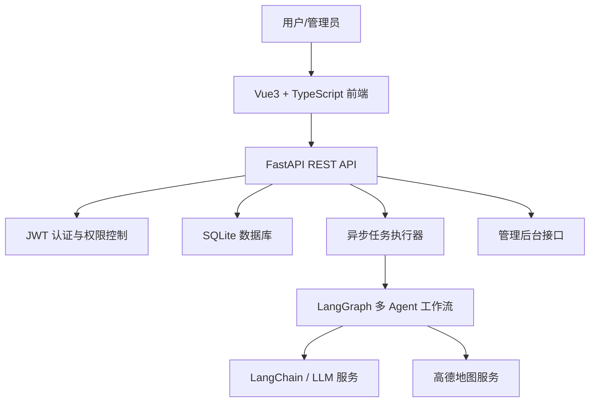
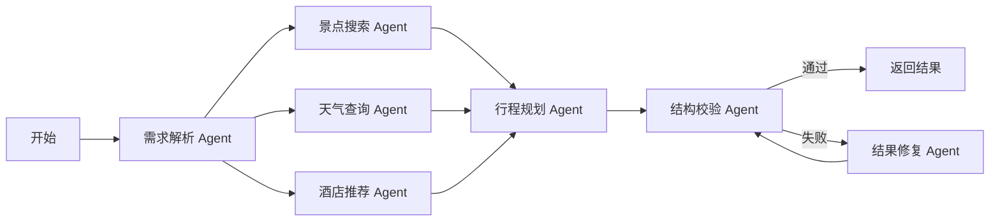
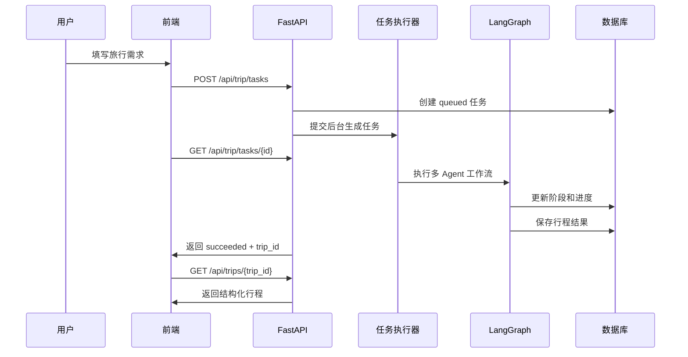
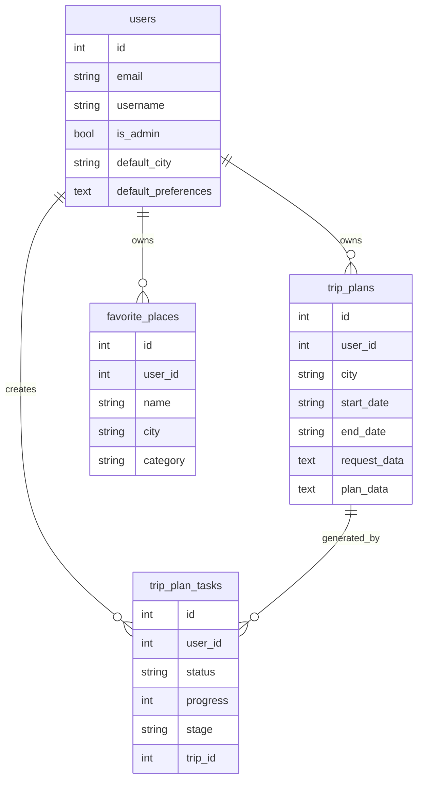

# 系统架构说明

本文档用于毕业设计答辩和二次开发说明，重点解释系统为什么不是简单的“调用一次大模型”，而是一个包含认证、数据库、任务调度、地图服务和多 Agent 工作流的完整 Web 系统。

## 1. 总体架构

## 2. 前端模块

| 模块 | 页面 | 作用 |
| --- | --- | --- |
| 认证模块 | 登录、注册、403 | 区分普通用户和管理员 |
| 工作台 | Dashboard | 展示行程、收藏、城市数量和最近行程 |
| 规划模块 | Home | 输入旅行需求，展示 Agent 运行进度 |
| 结果模块 | Result | 展示每日行程、地图、预算、天气和 Agent 报告 |
| 行程模块 | MyTrips、TripDetail | 管理历史行程 |
| 收藏模块 | Favorites | 管理收藏地点 |
| 地图模块 | Explore、RoutePlanner | POI 探索和路线规划 |
| 用户画像 | Profile | 维护默认城市、交通、住宿和自定义标签 |
| 管理后台 | Admin | 查看用户、任务日志和系统统计 |

## 3. 后端模块

| 模块 | 文件 | 作用 |
| --- | --- | --- |
| API 应用 | `backend/app/api/main.py` | 注册路由、初始化数据库 |
| 认证 | `backend/app/auth.py` | 密码哈希、JWT、当前用户获取 |
| 数据库 | `backend/app/database.py` | SQLAlchemy 连接和 Session |
| ORM 模型 | `backend/app/db_models.py` | 用户、行程、收藏、任务表 |
| 旅行规划 | `backend/app/api/routes/trip.py` | 同步规划和异步任务规划 |
| 行程管理 | `backend/app/api/routes/trips.py` | 历史行程、收藏、工作台 |
| 管理后台 | `backend/app/api/routes/admin.py` | 系统统计、任务日志、用户列表 |
| 多 Agent | `backend/app/agents/trip_planner_agent.py` | LangGraph 工作流 |
| 工具服务 | `backend/app/tools`、`backend/app/services` | 高德、图片、LLM 封装 |

## 4. 多 Agent 工作流

每个节点都有明确职责：

| Agent | 主要职责 | 依赖能力 |
| --- | --- | --- |
| 需求解析 Agent | 规范化城市、日期、偏好和补充需求 | Pydantic、规则校验 |
| 景点搜索 Agent | 检索候选景点、地址、坐标和评分 | 高德 POI |
| 天气查询 Agent | 获取天气信息并辅助行程安排 | 高德天气 |
| 酒店推荐 Agent | 根据住宿偏好补充住宿信息 | 高德 POI |
| 行程规划 Agent | 汇总上下文并生成每日计划 | LangChain、LLM |
| 结构校验 Agent | 校验 JSON 结构、天数和字段完整性 | Pydantic |
| 结果修复 Agent | 修复不合法结构并重新校验 | LLM |

## 5. 数据流

## 6. 数据库实体

## 7. 后续可扩展方向

- 将 SQLite 切换为 MySQL 或 PostgreSQL，适合多人部署和并发使用。
- 将线程池任务升级为 Celery/RQ 等任务队列，适合正式生产环境。
- 将轮询升级为 SSE 或 WebSocket，实时推送 Agent 运行进度。
- 增加向量检索，利用历史对话、收藏和用户偏好做更强个性化推荐。
- 增加管理员对用户禁用、任务重试和异常详情查看的操作入口。
