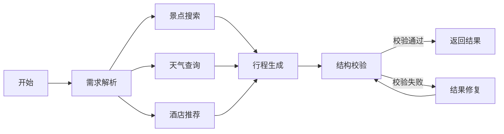
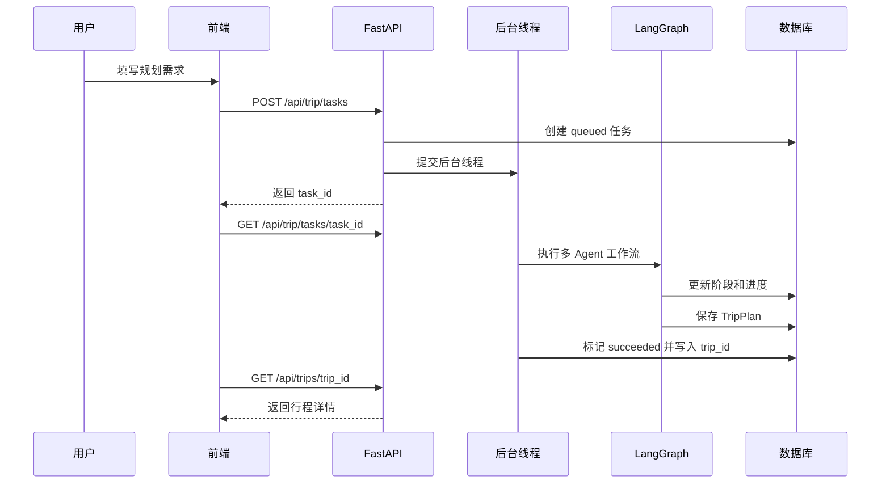
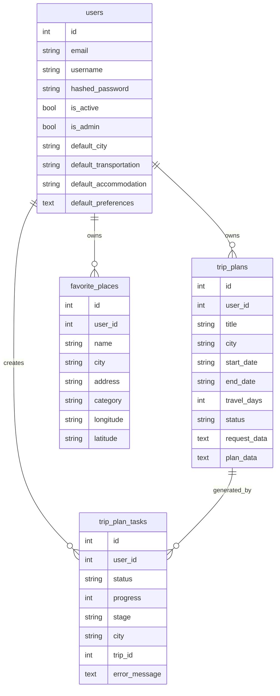

# TripMind 系统文档

本文档综合项目架构说明与毕业论文写作底稿，用于技术参考、答辩准备和论文撰写。

---

## 一、模块速查

### 前端模块

| 模块 | 页面 | 作用 |
| --- | --- | --- |
| 认证模块 | 登录、注册、403 | 区分普通用户和管理员 |
| 工作台 | Dashboard | 展示行程、收藏、城市数量和最近行程 |
| 规划模块 | Home | 输入旅行需求，展示 Agent 运行进度 |
| 结果模块 | Result | 展示每日行程、地图、预算、天气和导出能力 |
| 行程模块 | MyTrips、TripDetail | 管理历史行程 |
| 收藏模块 | Favorites | 管理收藏地点 |
| 地图模块 | Explore、RoutePlanner | POI 探索和路线规划 |
| 用户画像 | Profile | 维护默认城市、交通、住宿和自定义标签 |
| 管理后台 | Admin | 查看用户、任务日志和系统统计，停用异常普通用户 |

### 后端模块

| 模块 | 文件 | 作用 |
| --- | --- | --- |
| 应用入口 | `backend/app/api/main.py` | FastAPI 应用、CORS、路由挂载、启动事件 |
| 认证模块 | `backend/app/auth.py`、`backend/app/api/routes/auth.py` | 密码哈希、JWT、注册登录、个人资料 |
| 规划模块 | `backend/app/api/routes/trip.py` | 同步规划、异步任务创建、任务查询 |
| 行程收藏模块 | `backend/app/api/routes/trips.py` | Dashboard、行程 CRUD、收藏 CRUD |
| 地图模块 | `backend/app/api/routes/map.py` | POI 搜索、天气查询、路线规划 |
| 图片模块 | `backend/app/api/routes/poi.py` | 景点图片查询 |
| 后台模块 | `backend/app/api/routes/admin.py` | 统计、任务日志、用户启停 |
| 智能体模块 | `backend/app/agents/trip_planner_agent.py` | LangGraph 多 Agent 工作流 |
| 服务封装 | `backend/app/services` | LLM、高德、Unsplash、管理员种子 |
| 数据库模块 | `backend/app/database.py`、`backend/app/db_models.py` | 数据库连接和 ORM 模型 |

### 多 Agent 节点

| 节点 | 职责 | 关键技术 |
| --- | --- | --- |
| normalize_request | 检查城市等基本输入，初始化工作流状态 | Pydantic 请求模型 |
| search_attractions | 根据城市和偏好搜索候选景点 | 高德 POI、LangChain Tool |
| query_weather | 查询目的地天气预报 | 高德天气 |
| search_hotels | 根据住宿偏好搜索酒店 | 高德 POI |
| plan_itinerary | 汇总用户需求和工具结果，生成 `TripPlan` JSON | LLM、系统提示词 |
| validate_plan | 将模型输出解析为 `TripPlan` 并校验字段 | Pydantic |
| repair_plan | 修复不合法 JSON 并重新校验 | LLM |

### 后续可扩展方向

- 将 ORM 初始化升级为 Alembic 迁移脚本，便于后续维护表结构版本。
- 将线程池任务升级为 Celery/RQ 等任务队列，适合正式生产环境。
- 将轮询升级为 SSE 或 WebSocket，实时推送 Agent 运行进度。
- 增加向量检索，利用历史对话、收藏和用户偏好做更强个性化推荐。
- 增加任务重试、异常详情查看和更完整的运行审计。

---

## 二、架构图

### 总体架构

```mermaid
flowchart TB
  user["普通用户"] --> vue["Vue3 TypeScript 前端"]
  admin["管理员"] --> vue
  vue --> api["FastAPI REST API"]
  api --> auth["JWT 认证与权限控制"]
  api --> db["PostgreSQL 数据库"]
  api --> task["异步任务执行器"]
  task --> graph["LangGraph 多 Agent 工作流"]
  graph --> llm["OpenAI 兼容 LLM 服务"]
  graph --> amap["高德地图 REST API"]
  api --> image["Unsplash 图片服务"]
  vue --> amapJs["高德 Web JS API"]
```

### 多 Agent 工作流



### 异步任务时序



### 数据库 ER 图



---

## 三、需求分析

### 3.1 用户角色

| 角色 | 说明 | 主要权限 |
| --- | --- | --- |
| 普通用户 | 系统主要使用者，通过注册登录后使用旅行规划功能 | 创建行程、查看结果、管理历史行程、收藏地点、探索 POI、路线规划、维护个人偏好 |
| 管理员 | 由环境变量初始化的内置账号 | 查看统计数据、查看任务日志、查看用户列表、启用或停用普通用户 |
| 外部服务 | LLM、高德地图、Unsplash 等第三方能力 | 提供文本生成、POI、天气、路线和图片数据 |

### 3.2 功能需求

| 编号 | 功能 | 说明 | 对应实现 |
| --- | --- | --- | --- |
| FR-01 | 用户注册与登录 | 邮箱/用户名+密码注册，注册即登录；后端校验唯一性，拒绝停用账号 | `auth.py`、`routes/auth.py`、`Login.vue`、`Register.vue` |
| FR-02 | 权限控制 | 路由守卫区分公开/用户/管理员页面；后端依赖注入校验 Token 和 `is_admin` | `main.ts`、`App.vue`、`auth.py`、`routes/admin.py` |
| FR-03 | 个人偏好维护 | 维护默认城市、交通、住宿和偏好标签，规划页作为默认值 | `Profile.vue`、`routes/auth.py`、`db_models.py` |
| FR-04 | 智能旅行规划 | 创建异步规划任务，持续更新进度，成功后生成结构化 TripPlan | `Home.vue`、`routes/trip.py`、`trip_planner_agent.py` |
| FR-05 | 行程结果展示 | 展示城市、日期、景点、住宿、餐饮、天气、预算，并在高德地图标注 | `Result.vue`、`types/index.ts`、`models/schemas.py` |
| FR-06 | 行程编辑与导出 | 编辑景点字段、顺序、删除，保存到数据库，导出 PNG/PDF | `Result.vue`、`routes/trips.py` |
| FR-07 | 历史行程管理 | 查看列表、按城市/状态筛选、查看详情、复制、删除 | `MyTrips.vue`、`TripDetail.vue`、`routes/trips.py` |
| FR-08 | 地点收藏 | 手动添加或从 POI 页收藏，支持查看、删除 | `Favorites.vue`、`Explore.vue`、`routes/trips.py` |
| FR-09 | POI 探索 | 输入城市和关键词搜索真实 POI，地图显示标记，可加入收藏 | `Explore.vue`、`routes/map.py`、`services/amap_service.py` |
| FR-10 | 路线规划 | 输入起终点和交通方式，返回距离耗时并在地图绘制路线 | `RoutePlanner.vue`、`routes/map.py` |
| FR-11 | 管理后台 | 统计指标、任务日志、用户列表、停用/启用用户 | `Admin.vue`、`routes/admin.py`、`services/admin_seed.py` |

### 3.3 非功能需求

| 编号 | 需求 | 说明 |
| --- | --- | --- |
| NFR-01 | 可用性 | 清晰的表单、进度条、错误提示和结果展示；规划页显示 Agent 阶段 |
| NFR-02 | 性能 | 长耗时规划任务不阻塞前端；使用异步任务 ID 和轮询，后端线程池执行 |
| NFR-03 | 安全性 | 密码 PBKDF2-HMAC-SHA256 哈希存储；接口使用 Bearer Token 鉴权 |
| NFR-04 | 数据持久化 | 用户、行程、收藏和任务日志全部保存到 PostgreSQL |
| NFR-05 | 可维护性 | 后端 Pydantic Schema 与前端 TypeScript 类型对应，接口有自动文档 |
| NFR-06 | 可扩展性 | 线程池可升级 Celery/RQ，轮询可升级 SSE/WebSocket |
| NFR-07 | 容错性 | LLM 输出 Pydantic 校验失败后进入修复节点 |

### 3.4 核心用例

**UC-01 用户创建旅行计划**

| 项目 | 内容 |
| --- | --- |
| 参与者 | 普通用户 |
| 前置条件 | 用户已登录，后端配置 LLM Key 和高德 Key |
| 基本流程 | 填写规划表单 → `POST /api/trip/tasks` → 前端轮询任务状态 → 多 Agent 工作流执行 → 成功后跳转结果页 |
| 异常流程 | 未登录返回 401；外部服务失败或 LLM 输出不可修复则任务标记 failed |
| 后置条件 | 生成 `trip_plans` 记录，关联 `trip_plan_tasks.trip_id` |

**UC-02 用户编辑并导出行程**

| 项目 | 内容 |
| --- | --- |
| 参与者 | 普通用户 |
| 前置条件 | 用户已生成或打开一份行程 |
| 基本流程 | 进入结果页 → 编辑模式调整景点 → 保存 → 导出 PNG 或 PDF |
| 异常流程 | 数据库保存失败时保留本地修改并提示同步失败 |
| 后置条件 | 行程内容更新，用户获得导出文件 |

**UC-03 用户探索并收藏地点**

| 项目 | 内容 |
| --- | --- |
| 参与者 | 普通用户 |
| 前置条件 | 用户已登录，地图 Key 已配置 |
| 基本流程 | 输入城市和关键词 → 搜索 POI → 地图显示结果 → 选择地点填写备注 → 加入收藏 |
| 后置条件 | 收藏地点写入 `favorite_places` |

**UC-04 管理员查看任务日志**

| 项目 | 内容 |
| --- | --- |
| 参与者 | 管理员 |
| 前置条件 | 管理员已登录 |
| 基本流程 | 进入后台 → 查看任务总数、成功率、失败任务、热门城市，按状态筛选任务 |
| 异常流程 | 普通用户访问后台返回 403 |

---

## 四、核心实现说明

### 4.1 用户认证与权限控制

后端 `backend/app/auth.py` 自实现 JWT 创建与校验，Token 使用 HS256 签名。密码通过 PBKDF2-HMAC-SHA256 加盐哈希存储。`get_current_user` 从 Authorization Header 中解析 Bearer Token，并检查用户是否存在且处于启用状态。

前端 `frontend/src/services/api.ts` 将 Token 和用户信息保存到 `localStorage`，Axios 请求拦截器自动添加 `Authorization: Bearer <token>`。路由守卫根据 Token 和用户角色控制页面访问，管理员登录后默认进入后台。

论文写作重点：密码哈希保证存储安全；JWT 避免服务器维护会话状态；前后端同时做权限控制，前端提升体验，后端保证安全边界。

### 4.2 异步规划任务

`backend/app/api/routes/trip.py` 中 `POST /api/trip/tasks` 创建 `TripPlanTask` 记录后立即返回任务 ID，并通过 `ThreadPoolExecutor` 提交后台函数 `_run_trip_plan_task`。

后台函数创建 `MultiAgentTripPlanner` 实例并调用 `plan_trip`。工作流每到关键阶段通过 `progress_callback` 更新数据库中的进度和阶段。成功后将 `TripPlan` 写入 `trip_plans`，再将任务标记为 `succeeded` 并记录 `trip_id`；失败时标记为 `failed` 并保存错误信息。

前端 `Home.vue` 提交表单后每 2.5 秒轮询 `fetchTripPlanTask`，状态为 succeeded 时读取行程详情并跳转结果页；状态为 failed 时显示错误。

论文写作重点：异步任务改善大模型长耗时体验；任务表承担状态持久化，也为后台提供可观测数据；本地演示使用线程池，后续可升级独立任务队列。

### 4.3 多 Agent 行程生成

`backend/app/agents/trip_planner_agent.py` 使用 LangGraph 构建状态图，将旅行规划拆为多个职责清晰的节点。

工作流输入为 `TripRequest`（城市、日期、天数、每日景点数、交通、住宿、偏好和额外要求）。景点、天气和酒店节点通过 `backend/app/tools/amap_tools.py` 调用高德服务获取真实候选数据。行程生成节点将用户请求与工具结果组装为提示词，要求模型只返回符合 `TripPlan` 结构的 JSON。

校验节点调用 `_parse_response` 提取 JSON，再用 Pydantic 的 `TripPlan` 模型校验字段。如果校验失败，则进入修复节点由 LLM 根据错误信息修复输出。

论文写作重点：工具结果约束 LLM，减少凭空编造；Pydantic 校验让大模型输出转化为可靠结构化数据；修复节点提高鲁棒性；LangGraph 状态图使各节点职责明确。

### 4.4 地图服务与外部数据融合

后端 `AmapService` 封装高德 REST API，包括 POI 搜索、天气查询、地理编码和路线规划。Agent 工具和地图路由共用同一服务层，避免重复代码。

前端探索页通过 `/api/map/poi` 搜索地点，使用高德 Web JS API 显示地图标记。路线规划页通过 `/api/map/route` 获取距离和耗时，再使用高德 JS 插件绘制路线。结果页根据景点坐标绘制标记和路线折线。

论文写作重点：高德 REST API 用于后端数据获取；高德 Web JS API 用于前端可视化；地图服务让行程结果从文本描述升级为地理可视化。

### 4.5 行程结果、编辑与导出

结果页 `Result.vue` 优先从 `sessionStorage` 读取刚生成的行程，也可通过 `tripId` 调用后端接口获取已保存行程。页面展示行程概览、预算、地图、每日景点、酒店、餐饮和天气信息。

编辑模式下用户可修改景点地址、游览时长和描述，也可删除或调整顺序。保存时更新 `sessionStorage`，如存在 `tripId` 则调用 `updateTrip` 同步到数据库。导出功能按需加载 `html2canvas` 和 `jspdf`，减少初始加载体积。

论文写作重点：结果以结构化组件展示而非简单文本；用户可对 AI 结果进行二次编辑；导出功能满足答辩演示和实际分享场景。

### 4.6 管理后台

`backend/app/api/routes/admin.py` 提供统计、任务日志和用户管理接口。统计指标包括用户数、行程数、收藏数、任务总数、成功率、失败任务数、近 7 天任务数和热门目的地。管理员账号由后端启动时根据环境变量初始化，普通注册用户不会成为管理员。

论文写作重点：管理后台体现系统完整性；任务日志可观察 Agent 运行情况；用户停用功能体现基础运维管理能力。

---

## 五、测试方案

### 5.1 测试环境

| 项目 | 配置 |
| --- | --- |
| 操作系统 | Windows 10/11 |
| 后端运行环境 | Python 3.10+、FastAPI、Uvicorn |
| 前端运行环境 | Node.js 18+、Vue3、Vite |
| 数据库 | PostgreSQL 14+ |
| 外部服务 | OpenAI 兼容 LLM API、高德地图 API、Unsplash API |
| 启动方式 | `.\start-dev.ps1`，前端 `http://localhost:5173`，后端 `http://localhost:8000` |

### 5.2 功能测试用例

| 编号 | 测试项 | 操作步骤 | 预期结果 |
| --- | --- | --- | --- |
| TC-01 | 用户注册 | 输入邮箱、用户名和密码提交 | 注册成功，返回 Token，进入用户页面 |
| TC-02 | 用户登录 | 输入邮箱或用户名和密码 | 登录成功，进入工作台 |
| TC-03 | 登录失败 | 输入错误密码 | 提示账号或密码错误 |
| TC-04 | 普通用户访问后台 | 访问 `/admin` | 跳转 403 |
| TC-05 | 创建规划任务 | 填写城市、日期、偏好并提交 | 返回任务 ID，显示进度条和阶段 |
| TC-06 | 行程生成成功 | 等待轮询完成 | 跳转结果页，展示每日行程、预算、天气和地图 |
| TC-07 | 行程生成失败 | 模拟 LLM 或地图服务异常 | 任务状态 failed，前端显示失败提示 |
| TC-08 | 编辑行程 | 修改景点描述、删除一个景点并保存 | 页面更新，数据库同步保存 |
| TC-09 | 导出行程 | 点击导出 PNG 或 PDF | 浏览器下载对应文件 |
| TC-10 | 查看历史行程 | 进入"我的行程"页面 | 显示行程列表，支持按城市和状态筛选 |
| TC-11 | 删除历史行程 | 点击删除并确认 | 行程从列表移除，数据库记录删除 |
| TC-12 | 添加收藏地点 | 手动输入地点信息并保存 | 收藏列表新增地点 |
| TC-13 | POI 探索收藏 | 在探索页搜索 POI 并加入收藏 | 地图显示标记，收藏写入成功 |
| TC-14 | 路线规划 | 输入起点、终点和交通方式 | 返回距离、耗时，地图展示路线 |
| TC-15 | 个人偏好保存 | 修改默认城市、交通、住宿、偏好 | 保存成功，规划页默认值更新 |
| TC-16 | 管理员查看统计 | 进入后台 | 显示用户数、行程数、任务数、成功率 |
| TC-17 | 管理员筛选任务 | 按状态筛选任务 | 表格只显示对应状态任务 |
| TC-18 | 管理员停用用户 | 点击停用并确认 | 用户状态变为停用，无法再次登录 |

### 5.3 非功能测试用例

| 编号 | 测试项 | 操作 | 预期结果 |
| --- | --- | --- | --- |
| NFT-01 | 表单校验 | 规划页不填城市或日期直接提交 | 提示必填项 |
| NFT-02 | 日期合法性 | 结束日期早于开始日期 | 提示结束日期不能早于开始日期 |
| NFT-03 | 长任务体验 | 创建耗时较长的规划任务 | 页面保持可响应，进度阶段持续更新 |
| NFT-04 | Token 缺失 | 清空 localStorage 后访问受保护页面 | 跳转登录页 |
| NFT-05 | 数据持久化 | 生成行程后刷新页面并进入历史行程 | 行程仍可读取 |
| NFT-06 | 外部配置缺失 | 不配置高德 JS Key 打开地图页 | 给出地图不可用提示 |
| NFT-07 | 重复收藏 | 对同一用户重复收藏同城同名地点 | 后端返回已有记录或避免重复写入 |

### 5.4 答辩演示流程

1. 启动系统，展示前端首页和后端 `/docs` 接口文档。
2. 注册或登录普通用户，进入工作台查看统计卡片。
3. 在个人中心设置默认城市、交通、住宿和偏好。
4. 在探索页搜索"北京 博物馆"，查看地图标记并收藏一个地点。
5. 进入规划页，填写目的地、日期、偏好和每日景点数，提交智能规划任务。
6. 展示进度条和 Agent 阶段：需求解析 → 景点搜索 → 天气查询 → 酒店查询 → 行程生成 → 结构校验 → 数据保存。
7. 生成成功后进入结果页，展示行程概览、预算、地图、每日景点、酒店、餐饮和天气。
8. 进入编辑模式，调整一个景点顺序或修改描述并保存。
9. 演示导出 PNG 或 PDF。
10. 进入我的行程，展示刚才保存的行程记录。
11. 登录管理员账号，展示任务日志、成功率、热门目的地和用户管理。

### 5.5 测试结论

通过功能测试可以看出，系统能够完成从用户注册登录、需求输入、智能规划、结果展示、行程保存到后台监控的完整闭环。异步任务机制避免了长时间生成导致页面阻塞的问题，多 Agent 工作流能够把地图 POI、天气、酒店和用户偏好整合为结构化行程。系统主要依赖 LLM、高德地图和 Unsplash 等外部服务，因此在网络异常或 API Key 配置错误时会影响部分功能，但整体架构具备良好的可扩展性和维护性。

---

## 六、毕业论文写作指引

### 6.1 建议论文目录

**摘要**

介绍旅行规划场景中信息分散、人工筛选成本高、个性化不足等问题，说明本文设计并实现 TripMind 智能旅行规划系统。突出系统采用 Vue3、FastAPI、PostgreSQL、LangGraph、LangChain 和高德地图服务，实现了从用户需求输入、智能行程生成、地图展示、历史行程管理到后台监控的一体化流程。

**第 1 章 绪论**

- 1.1 研究背景与意义：旅游信息服务从静态攻略检索向智能化、个性化规划发展的趋势；大语言模型与地图服务结合提升自动化与可用性。
- 1.2 国内外研究现状：在线旅游平台、推荐系统、智能问答、大语言模型 Agent、地图开放平台；强调本系统更关注"结构化需求输入 + 外部工具检索 + 多 Agent 编排 + 行程持久化"的完整 Web 应用实现。
- 1.3 研究内容：前后端分离架构设计、用户业务实现、多 Agent 生成流程、高德地图集成、异步任务机制、管理员后台。
- 1.4 论文组织结构。

**第 2 章 相关技术**

Vue3 与 TypeScript、FastAPI 与 Pydantic、SQLAlchemy 与 PostgreSQL、LangChain 与 LangGraph、高德地图服务、JWT 与密码哈希。

**第 3 章 系统需求分析**

角色分析、功能需求分析、非功能需求分析、用例分析（见本文档第三章）。

**第 4 章 系统总体设计**

总体架构、前端模块设计、后端模块设计、智能规划子系统设计、数据库设计（见本文档第一、二章）。

**第 5 章 系统详细设计与实现**

用户认证与权限控制、异步旅行规划任务、多 Agent 行程生成、地图与 POI 服务、行程结果展示与编辑导出、管理后台（见本文档第四章）。

**第 6 章 系统测试**

测试环境、功能测试、非功能测试、测试结果分析（见本文档第五章）。

**第 7 章 总结与展望**

总结实现成果；展望：Alembic 数据库迁移、Celery/RQ 任务队列、SSE/WebSocket 实时推送、向量检索和更精细化个性推荐。

### 6.2 亮点提炼

- **工程完整性**：包含登录注册、权限控制、用户偏好、智能规划、历史行程、收藏、地图探索、路线规划、结果导出和后台管理的完整应用，而非单页面 Demo。
- **多 Agent 智能规划**：通过 LangGraph 将旅行规划拆成多个节点，串联需求解析、工具检索、LLM 生成、结构校验和结果修复，执行流程清晰且可维护。
- **真实外部数据融合**：使用高德地图提供 POI、天气、路线和坐标数据，避免纯文本生成脱离真实地理信息，前端地图展示增强直观性。
- **异步任务与可观测性**：任务通过数据库记录状态、进度和阶段，前端轮询展示，后台统计成功率和失败原因，适合在答辩中强调工程设计。
- **结构化结果与用户可编辑**：LLM 输出经 Pydantic 校验后形成结构化 `TripPlan`，结果页按组件展示，并允许编辑和导出，体现 AI 生成内容落地到真实业务系统的过程。

### 6.3 可直接放入论文的系统简介

TripMind 智能旅行规划系统是一个基于大语言模型与地图服务的 Web 应用。系统采用前后端分离架构，前端使用 Vue3、TypeScript、Vite 和 Ant Design Vue 构建交互界面，后端使用 FastAPI、SQLAlchemy 和 PostgreSQL 实现业务接口与数据持久化。系统通过 LangGraph 构建多 Agent 工作流，将用户旅行需求解析、景点搜索、天气查询、酒店推荐、行程生成、结构校验和结果修复等步骤进行编排，并结合高德地图 REST API 获取真实 POI、天气和路线信息。用户可以完成注册登录、个性化行程规划、历史行程管理、地点收藏、地图探索、路线规划和结果导出等操作，管理员可以通过后台查看用户、任务日志和系统统计。该系统解决了传统旅行规划中信息分散、手动筛选成本高和个性化不足的问题，具有一定的实用价值和扩展空间。
