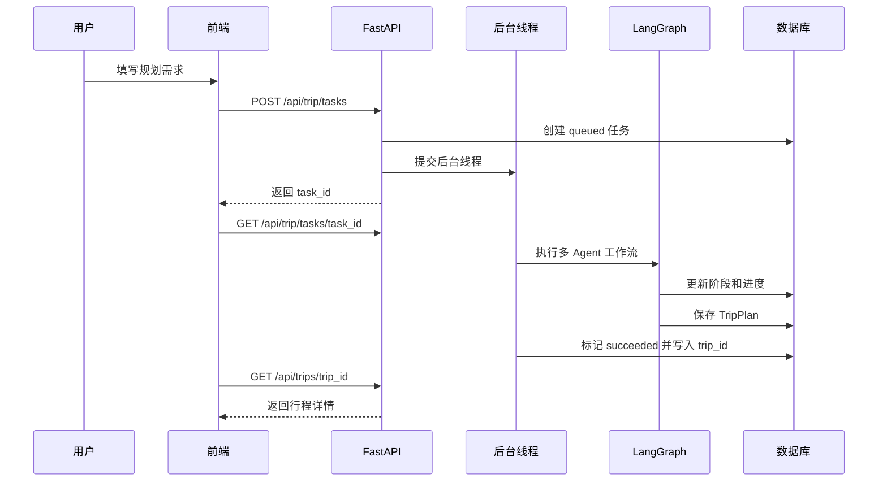
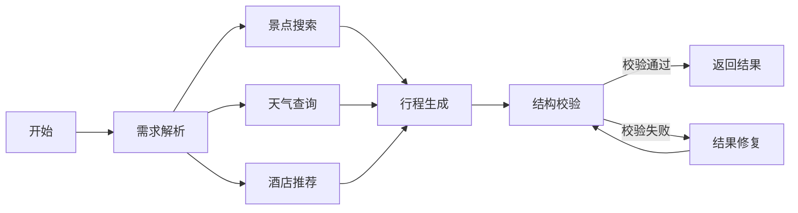
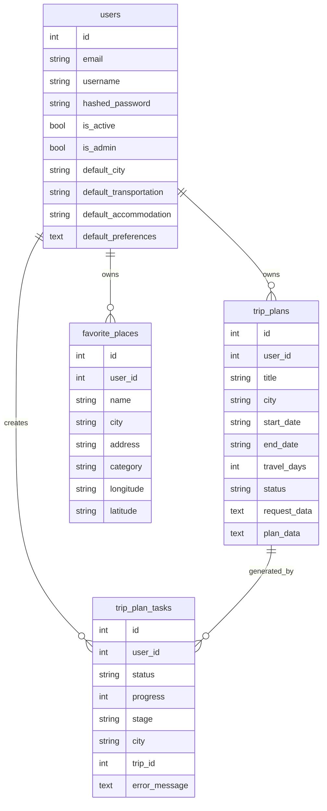

# TripMind 智能旅行规划系统毕业论文写作底稿

本文档基于当前项目代码整理，用于毕业论文正文撰写和答辩材料准备。项目定位为“基于大语言模型与地图服务的智能旅行规划系统”，系统形态为前后端分离 Web 应用，重点体现用户认证、异步任务、多 Agent 编排、地图服务融合、结构化结果持久化和管理后台。

## 1. 建议论文目录

### 摘要

介绍旅行规划场景中信息分散、人工筛选成本高、个性化不足等问题，说明本文设计并实现 TripMind 智能旅行规划系统。摘要中应突出系统采用 Vue3、FastAPI、PostgreSQL、LangGraph、LangChain 和高德地图服务，实现了从用户需求输入、智能行程生成、地图展示、历史行程管理到后台监控的一体化流程。

### 第 1 章 绪论

1.1 研究背景与意义  
说明旅游信息服务从静态攻略检索向智能化、个性化规划发展的趋势。传统方式需要用户在多个平台之间反复查询景点、路线、天气、住宿和预算，信息整合成本高。大语言模型具备自然语言理解与方案生成能力，地图服务可以提供真实 POI、天气和路线数据，将两者结合可以提升旅行规划的自动化与可用性。

1.2 国内外研究现状  
可从在线旅游平台、推荐系统、智能问答、大语言模型 Agent、地图开放平台等角度展开。强调现有平台通常偏重信息展示或单点推荐，而本系统更关注“结构化需求输入 + 外部工具检索 + 多 Agent 编排 + 行程持久化”的完整 Web 应用实现。

1.3 研究内容  
围绕以下内容展开：

- 设计前后端分离的智能旅行规划系统架构。
- 实现用户注册登录、个人偏好、历史行程、收藏地点等基础业务。
- 基于 LangGraph 构建多 Agent 行程生成流程。
- 集成高德地图 REST API 与 Web JS API，实现 POI、天气、路线和地图展示。
- 设计异步任务与进度轮询机制，解决大模型生成耗时问题。
- 实现管理员后台，对用户、任务日志和系统运行数据进行统计展示。

1.4 论文组织结构  
说明后续章节安排：需求分析、总体设计、详细设计与实现、系统测试、总结与展望。

### 第 2 章 相关技术

2.1 Vue3 与 TypeScript  
介绍组合式 API、组件化开发、类型约束和前端工程化。

2.2 FastAPI 与 Pydantic  
介绍 REST API、依赖注入、请求响应模型校验和自动接口文档。

2.3 SQLAlchemy 与 PostgreSQL  
介绍 ORM 映射、关系型数据建模、会话管理和持久化。

2.4 LangChain 与 LangGraph  
说明 LangChain 用于接入 OpenAI 兼容模型，LangGraph 用于构建状态图式多 Agent 工作流。

2.5 高德地图服务  
说明高德 REST API 用于后端 POI、天气、路线能力，高德 JS API 用于前端地图展示。

2.6 JWT 与密码哈希  
说明系统使用 Bearer Token 维护登录状态，密码通过 PBKDF2-HMAC-SHA256 进行哈希存储。

### 第 3 章 系统需求分析

3.1 系统角色分析  
系统包含普通用户、管理员和外部服务三类参与者。普通用户使用旅行规划、行程管理、收藏和地图功能；管理员查看统计、任务日志并管理用户状态；外部服务包括大语言模型接口、高德地图服务和 Unsplash 图片服务。

3.2 功能需求分析  
按照认证、规划、行程、收藏、地图、个人中心、后台管理等模块描述。

3.3 非功能需求分析  
从可用性、响应性能、数据一致性、安全性、可维护性、可扩展性等角度描述。

3.4 用例分析  
给出核心用例：用户注册登录、创建行程规划任务、查看行程结果、编辑导出行程、收藏地点、探索 POI、规划路线、管理员查看任务日志、管理员停用用户。

### 第 4 章 系统总体设计

4.1 系统总体架构  
说明前端、后端、数据库、外部服务和智能体子系统之间的关系。

4.2 前端模块设计  
描述页面路由、导航布局、鉴权守卫、API 封装和本地状态存储。

4.3 后端模块设计  
描述 API 主应用、认证模块、旅行规划模块、行程收藏模块、地图模块、后台管理模块和服务封装层。

4.4 智能规划子系统设计  
重点介绍 LangGraph 多 Agent 工作流：需求解析、景点搜索、天气查询、酒店推荐、行程生成、结构校验和结果修复。

4.5 数据库设计  
说明 users、trip_plans、favorite_places、trip_plan_tasks 四张核心表。

### 第 5 章 系统详细设计与实现

5.1 用户认证与权限控制实现  
结合 `backend/app/auth.py`、`frontend/src/main.ts` 和 `frontend/src/services/api.ts` 描述。

5.2 异步旅行规划任务实现  
结合 `backend/app/api/routes/trip.py` 和 `frontend/src/views/Home.vue` 描述任务创建、线程池执行和前端轮询。

5.3 多 Agent 行程生成实现  
结合 `backend/app/agents/trip_planner_agent.py` 描述状态图、工具调用、LLM 提示词、结构校验和修复。

5.4 地图与 POI 服务实现  
结合 `backend/app/services/amap_service.py`、`backend/app/tools/amap_tools.py`、`frontend/src/views/Explore.vue` 和 `frontend/src/views/RoutePlanner.vue` 描述。

5.5 行程结果展示与编辑导出实现  
结合 `frontend/src/views/Result.vue` 描述结果加载、地图标注、预算天气展示、编辑保存和 PNG/PDF 导出。

5.6 管理后台实现  
结合 `backend/app/api/routes/admin.py` 和 `frontend/src/views/Admin.vue` 描述统计、任务日志、用户列表和停用用户。

### 第 6 章 系统测试

6.1 测试环境  
说明 Windows、本地 PostgreSQL、FastAPI、Vue/Vite、高德 Key、LLM Key 等运行条件。

6.2 功能测试  
覆盖注册登录、行程规划、结果展示、编辑保存、收藏、探索、路线、后台等用例。

6.3 非功能测试  
覆盖权限控制、异常提示、长任务进度、表单校验、数据持久化等。

6.4 测试结果分析  
总结系统能完成主要业务流程，并指出依赖外部 API Key 和网络质量的部分存在不确定性。

### 第 7 章 总结与展望

总结系统实现成果：完成了一个具备真实数据融合和多 Agent 规划能力的智能旅行规划系统。展望部分可写：引入 Alembic 数据库迁移、Celery/RQ 任务队列、SSE/WebSocket 实时推送、向量检索和更精细化个性推荐。

## 2. 需求分析

### 2.1 用户角色

| 角色 | 说明 | 主要权限 |
| --- | --- | --- |
| 普通用户 | 系统主要使用者，通过注册登录后使用旅行规划功能 | 创建行程、查看结果、管理历史行程、收藏地点、探索 POI、路线规划、维护个人偏好 |
| 管理员 | 由环境变量初始化的内置账号 | 查看统计数据、查看任务日志、查看用户列表、启用或停用普通用户 |
| 外部服务 | LLM、高德地图、Unsplash 等第三方能力 | 提供文本生成、POI、天气、路线和图片数据 |

### 2.2 功能需求

#### FR-01 用户注册与登录

用户可以通过邮箱、用户名和密码注册账号。注册成功后系统返回 Token 并自动登录。用户也可以通过邮箱或用户名登录。后端需要校验邮箱、用户名唯一性，并拒绝已停用用户登录。

对应实现：

- `backend/app/api/routes/auth.py`
- `backend/app/auth.py`
- `frontend/src/views/Login.vue`
- `frontend/src/views/Register.vue`
- `frontend/src/services/api.ts`

#### FR-02 权限控制

系统前端通过路由元信息区分公开页面、普通用户页面和管理员页面。未登录用户访问受保护页面时跳转登录页，普通用户访问管理后台时跳转 403 页面。后端通过依赖注入获取当前用户，管理员接口额外校验 `is_admin`。

对应实现：

- `frontend/src/main.ts`
- `frontend/src/App.vue`
- `backend/app/auth.py`
- `backend/app/api/routes/admin.py`

#### FR-03 个人偏好维护

用户可以维护默认城市、默认交通方式、默认住宿类型和旅行偏好标签。规划页会读取这些信息作为默认值，减少重复输入。

对应实现：

- `frontend/src/views/Profile.vue`
- `backend/app/api/routes/auth.py`
- `backend/app/db_models.py`

#### FR-04 智能旅行规划

用户输入目的地城市、起止日期、旅行天数、每日景点数、交通方式、住宿偏好、偏好标签和额外要求后，系统创建异步规划任务。任务执行过程中，系统持续更新进度和阶段。任务成功后生成结构化 `TripPlan` 并保存为用户行程。

对应实现：

- `frontend/src/views/Home.vue`
- `backend/app/api/routes/trip.py`
- `backend/app/agents/trip_planner_agent.py`
- `backend/app/models/schemas.py`

#### FR-05 行程结果展示

系统需要展示城市、日期、每日景点、住宿、餐饮、天气、预算和总体建议。结果页还应在高德地图上显示景点标记和每日路线折线。

对应实现：

- `frontend/src/views/Result.vue`
- `frontend/src/types/index.ts`
- `backend/app/models/schemas.py`

#### FR-06 行程编辑与导出

用户可以在结果页进入编辑模式，修改景点地址、描述、游览时长，删除或调整景点顺序。修改后可同步保存到数据库。用户还可以将结果导出为 PNG 图片或 PDF 文件。

对应实现：

- `frontend/src/views/Result.vue`
- `backend/app/api/routes/trips.py`

#### FR-07 历史行程管理

用户可以查看历史行程列表，按城市和状态筛选，查看详情、复制或删除行程。详情页用于展示已保存行程内容。

对应实现：

- `frontend/src/views/MyTrips.vue`
- `frontend/src/views/TripDetail.vue`
- `backend/app/api/routes/trips.py`

#### FR-08 地点收藏

用户可以手动添加收藏地点，也可以在 POI 探索页将搜索结果加入收藏。收藏内容包括名称、城市、地址、类型、经纬度和备注。收藏地点可以作为后续规划上下文的一部分。

对应实现：

- `frontend/src/views/Favorites.vue`
- `frontend/src/views/Explore.vue`
- `frontend/src/views/Home.vue`
- `backend/app/api/routes/trips.py`

#### FR-09 POI 探索

用户输入城市和关键词后，系统调用高德 POI 搜索接口，返回真实地点列表并在地图上显示标记。用户可查看地点类型、地址和坐标，并加入收藏。

对应实现：

- `frontend/src/views/Explore.vue`
- `backend/app/api/routes/map.py`
- `backend/app/services/amap_service.py`

#### FR-10 路线规划

用户输入起点、终点、城市和交通方式后，系统调用后端路线规划接口获取距离、耗时和路线描述，并在前端地图上绘制路线。

对应实现：

- `frontend/src/views/RoutePlanner.vue`
- `backend/app/api/routes/map.py`
- `backend/app/services/amap_service.py`

#### FR-11 管理后台

管理员可以查看用户数、行程数、收藏数、任务总数、成功率、失败任务数、热门目的地、任务日志和用户列表，并能停用或启用普通用户。

对应实现：

- `frontend/src/views/Admin.vue`
- `backend/app/api/routes/admin.py`
- `backend/app/services/admin_seed.py`

### 2.3 非功能需求

| 编号 | 需求 | 说明 |
| --- | --- | --- |
| NFR-01 可用性 | 页面需要提供清晰的表单、进度条、错误提示和结果展示 | 规划页显示 Agent 阶段，结果页按概览、预算、地图、每日行程组织内容 |
| NFR-02 性能 | 长耗时规划任务不能阻塞前端页面 | 使用异步任务 ID 和轮询机制，后端线程池执行规划 |
| NFR-03 安全性 | 用户密码不能明文保存，接口需要鉴权 | 密码使用 PBKDF2-HMAC-SHA256，接口使用 Bearer Token |
| NFR-04 数据持久化 | 用户、行程、收藏和任务日志需要持久保存 | 使用 PostgreSQL 和 SQLAlchemy ORM |
| NFR-05 可维护性 | 前后端类型和接口需要相对清晰 | 后端 Pydantic Schema 与前端 TypeScript 类型对应 |
| NFR-06 可扩展性 | 后续可替换任务队列、推送方式和推荐能力 | 当前线程池可升级 Celery/RQ，轮询可升级 SSE/WebSocket |
| NFR-07 容错性 | LLM 输出可能不是合法 JSON，需要校验和修复 | Pydantic 校验失败后进入修复节点 |

### 2.4 核心用例

#### UC-01 用户创建旅行计划

| 项目 | 内容 |
| --- | --- |
| 参与者 | 普通用户 |
| 前置条件 | 用户已登录，后端配置 LLM Key 和高德 Key |
| 基本流程 | 用户填写规划表单；前端提交 `/api/trip/tasks`；后端创建任务；前端轮询任务状态；后端执行多 Agent 工作流；成功后保存行程；前端跳转结果页 |
| 异常流程 | 未登录则返回 401；外部服务失败或 LLM 输出不可修复则任务标记 failed；前端提示失败原因 |
| 后置条件 | 成功时生成 `trip_plans` 记录，并关联 `trip_plan_tasks.trip_id` |

#### UC-02 用户编辑并导出行程

| 项目 | 内容 |
| --- | --- |
| 参与者 | 普通用户 |
| 前置条件 | 用户已生成或打开一份行程 |
| 基本流程 | 用户进入结果页；点击编辑行程；调整景点顺序或字段；保存修改；导出 PNG 或 PDF |
| 异常流程 | 数据库保存失败时保留本地修改并提示同步失败 |
| 后置条件 | 行程内容更新，用户获得导出文件 |

#### UC-03 用户探索并收藏地点

| 项目 | 内容 |
| --- | --- |
| 参与者 | 普通用户 |
| 前置条件 | 用户已登录，地图 Key 已配置 |
| 基本流程 | 输入城市和关键词；系统搜索 POI；地图显示结果；用户选择地点并填写备注；加入收藏 |
| 异常流程 | 搜索无结果时提示；地图 Key 缺失时提示地图不可用 |
| 后置条件 | 收藏地点写入 `favorite_places` |

#### UC-04 管理员查看任务日志

| 项目 | 内容 |
| --- | --- |
| 参与者 | 管理员 |
| 前置条件 | 管理员已登录 |
| 基本流程 | 进入后台；查看任务总数、成功率、失败任务、热门城市；按状态筛选任务日志 |
| 异常流程 | 普通用户访问后台返回 403 |
| 后置条件 | 管理员获得系统运行状态信息 |

## 3. 系统设计

### 3.1 总体架构

系统采用前后端分离架构。前端负责页面展示、表单输入、地图渲染和接口调用；后端负责认证、业务接口、数据库读写、任务调度和第三方服务封装；数据库保存用户、行程、收藏和任务日志；智能规划子系统通过 LangGraph 编排多个节点，并调用 LLM 和高德地图工具生成结构化旅行计划。

```mermaid
flowchart TB
  user["普通用户"] --> vue["Vue3 TypeScript 前端"]
  admin["管理员"] --> vue
  vue --> api["FastAPI REST API"]
  api --> auth["JWT 认证与权限控制"]
  api --> db["PostgreSQL 数据库"]
  api --> task["异步任务执行器"]
  task --> graph["LangGraph 多 Agent 工作流"]
  graph --> llm["OpenAI 兼容 LLM 服务"]
  graph --> amap["高德地图 REST API"]
  api --> image["Unsplash 图片服务"]
  vue --> amapJs["高德 Web JS API"]
```

### 3.2 前端设计

前端基于 Vue3、TypeScript、Vite 和 Ant Design Vue 实现。`frontend/src/main.ts` 使用 Vue Router 定义页面，并通过 `requiresAuth`、`requiresAdmin`、`publicOnly` 元信息实现路由守卫。`frontend/src/App.vue` 根据当前页面类型显示普通用户导航或管理员布局。

主要前端模块如下：

| 模块 | 页面 | 说明 |
| --- | --- | --- |
| 认证模块 | `Login.vue`、`Register.vue`、`Forbidden.vue` | 登录、注册、无权限提示 |
| 工作台模块 | `Dashboard.vue` | 展示行程数、收藏数、探索城市数和最近行程 |
| 智能规划模块 | `Home.vue` | 填写需求、创建异步任务、展示进度 |
| 结果模块 | `Result.vue` | 展示结构化行程、地图、天气、预算、编辑和导出 |
| 行程模块 | `MyTrips.vue`、`TripDetail.vue` | 历史行程列表、筛选、详情、删除 |
| 收藏模块 | `Favorites.vue` | 收藏地点新增、查看、删除 |
| 地图模块 | `Explore.vue`、`RoutePlanner.vue` | POI 探索和路线规划 |
| 用户画像模块 | `Profile.vue` | 默认城市、交通、住宿和偏好维护 |
| 管理后台 | `Admin.vue` | 统计、任务日志、用户管理 |

### 3.3 后端设计

后端基于 FastAPI 实现，主应用位于 `backend/app/api/main.py`。系统启动时完成配置加载、数据库初始化和默认管理员初始化。路由以 `/api` 为统一前缀，按业务拆分为认证、规划、行程、地图、POI 和后台管理。

主要后端模块如下：

| 模块 | 文件 | 说明 |
| --- | --- | --- |
| 应用入口 | `backend/app/api/main.py` | FastAPI 应用、CORS、路由挂载、启动事件 |
| 认证模块 | `backend/app/auth.py`、`backend/app/api/routes/auth.py` | 密码哈希、JWT、注册登录、个人资料 |
| 规划模块 | `backend/app/api/routes/trip.py` | 同步规划、异步任务创建、任务查询 |
| 行程收藏模块 | `backend/app/api/routes/trips.py` | Dashboard、行程 CRUD、收藏 CRUD |
| 地图模块 | `backend/app/api/routes/map.py` | POI 搜索、天气查询、路线规划 |
| 图片模块 | `backend/app/api/routes/poi.py` | 景点图片查询 |
| 后台模块 | `backend/app/api/routes/admin.py` | 统计、任务日志、用户启停 |
| 智能体模块 | `backend/app/agents/trip_planner_agent.py` | LangGraph 多 Agent 工作流 |
| 服务封装 | `backend/app/services` | LLM、高德、Unsplash、管理员种子 |
| 数据库模块 | `backend/app/database.py`、`backend/app/db_models.py` | 数据库连接和 ORM 模型 |

### 3.4 异步任务设计

旅行规划涉及 LLM 和外部地图服务调用，耗时可能较长。系统采用“创建任务 + 后台执行 + 前端轮询”的方式避免请求长时间阻塞。



### 3.5 多 Agent 工作流设计

智能规划子系统由 `MultiAgentTripPlanner` 实现。工作流先校验和标准化用户请求，再并行收集景点、天气和酒店信息，随后由 LLM 整合生成结构化 JSON，最后通过 Pydantic 校验。如果输出不合法，则进入修复节点。



各节点职责：

| 节点 | 职责 | 关键技术 |
| --- | --- | --- |
| normalize_request | 检查城市等基本输入，初始化工作流状态 | Pydantic 请求模型 |
| search_attractions | 根据城市和偏好搜索候选景点 | 高德 POI、LangChain Tool |
| query_weather | 查询目的地天气预报 | 高德天气 |
| search_hotels | 根据住宿偏好搜索酒店 | 高德 POI |
| plan_itinerary | 汇总用户需求和工具结果，生成 `TripPlan` JSON | LLM、系统提示词 |
| validate_plan | 将模型输出解析为 `TripPlan` 并校验字段 | Pydantic |
| repair_plan | 修复不合法 JSON 并重新校验 | LLM |

### 3.6 数据库设计

系统使用 PostgreSQL 作为默认数据库，SQLAlchemy ORM 自动创建业务表。核心实体关系如下：



#### users 表

保存用户账号、密码哈希、头像、默认偏好、账号状态和角色标记。普通注册用户 `is_admin` 默认为 false，管理员由环境变量初始化。

#### trip_plans 表

保存用户行程计划。`request_data` 保存原始规划请求 JSON，`plan_data` 保存结构化行程 JSON，便于后续查看、编辑和导出。

#### favorite_places 表

保存用户收藏地点，字段包括名称、城市、地址、类别、经纬度和备注。表上有用户、地点名称和城市的唯一约束，避免重复收藏。

#### trip_plan_tasks 表

保存异步规划任务的运行状态，包括 queued、running、succeeded、failed、progress、stage、error_message 和生成后的 `trip_id`。

## 4. 核心实现说明

### 4.1 用户认证与权限控制

后端 `backend/app/auth.py` 自实现 JWT 创建与校验，Token 使用 HS256 签名。密码通过 PBKDF2-HMAC-SHA256 加盐哈希存储，避免明文保存密码。`get_current_user` 从 Authorization Header 中解析 Bearer Token，并检查用户是否存在且处于启用状态。

前端 `frontend/src/services/api.ts` 将 Token 和用户信息保存到 `localStorage`，Axios 请求拦截器自动添加 `Authorization: Bearer <token>`。路由守卫根据 Token 和用户角色控制页面访问，管理员登录后默认进入后台。

论文可写重点：

- 密码哈希保证密码存储安全。
- JWT 避免服务器维护会话状态。
- 前后端同时做权限控制，前端提升体验，后端保证安全边界。

### 4.2 异步规划任务

`backend/app/api/routes/trip.py` 中 `POST /api/trip/tasks` 接收 `TripRequest`，要求用户已登录。接口创建 `TripPlanTask` 记录后立即返回任务 ID，并通过 `ThreadPoolExecutor` 提交后台函数 `_run_trip_plan_task`。

后台函数读取任务请求数据，创建 `MultiAgentTripPlanner` 实例，调用 `plan_trip`。工作流每到关键阶段会通过 `progress_callback` 更新数据库中的进度和阶段。成功后系统将 `TripPlan` 写入 `trip_plans`，再将任务标记为 `succeeded` 并记录 `trip_id`。失败时任务标记为 `failed` 并保存错误信息。

前端 `Home.vue` 在提交表单后调用 `createTripPlanTask`，随后每 2.5 秒轮询 `fetchTripPlanTask`。如果状态为 succeeded，则读取行程详情并跳转结果页；如果状态为 failed，则显示错误。

论文可写重点：

- 通过异步任务改善大模型长耗时请求体验。
- 任务表既承担运行状态持久化，也为管理后台提供可观测数据。
- 本地演示使用线程池，后续可升级为独立任务队列。

### 4.3 多 Agent 行程生成

`backend/app/agents/trip_planner_agent.py` 使用 LangGraph 构建状态图。该模块将旅行规划拆为多个职责清晰的节点，而不是直接把用户输入交给大模型一次性生成。

工作流输入为 `TripRequest`，包含城市、日期、天数、每日景点数、交通、住宿、偏好和额外要求。景点、天气和酒店节点通过 `backend/app/tools/amap_tools.py` 调用高德服务，得到真实候选数据。行程生成节点将用户请求、景点数据、天气数据和酒店数据组装为提示词，并要求模型只返回符合 `TripPlan` 结构的 JSON。

校验节点调用 `_parse_response` 提取 JSON，再用 Pydantic 的 `TripPlan` 模型校验字段。如果模型输出被 Markdown 包裹或包含多余文字，解析逻辑会尝试提取 JSON 主体。如果校验失败，则进入修复节点，由 LLM 根据错误信息修复输出。

论文可写重点：

- 工具结果约束 LLM，减少凭空编造地点和坐标。
- Pydantic 校验让大模型输出转化为可靠结构化数据。
- 修复节点提高系统鲁棒性。
- LangGraph 状态图使各节点职责明确，便于维护和扩展。

### 4.4 地图服务与外部数据融合

后端 `AmapService` 封装高德 REST API，包括 POI 搜索、天气查询、地理编码和路线规划。Agent 工具和地图路由共用同一服务层，避免重复代码。

前端探索页通过 `/api/map/poi` 搜索地点，并使用高德 Web JS API 显示地图标记。路线规划页通过 `/api/map/route` 获取距离和耗时，再使用高德 JS 插件绘制步行、驾车或公交路线。结果页根据行程中的景点坐标绘制标记和路线折线。

论文可写重点：

- 高德 REST API 用于后端数据获取。
- 高德 Web JS API 用于前端可视化展示。
- 地图服务让行程结果从文本描述升级为地理可视化。

### 4.5 行程结果、编辑与导出

结果页 `Result.vue` 优先从 `sessionStorage` 读取刚生成的行程，也可以通过 `tripId` 调用后端接口获取已保存行程。页面展示行程概览、预算、地图、每日景点、酒店、餐饮和天气信息。

编辑模式下，用户可修改景点地址、游览时长和描述，也可删除或调整景点顺序。保存时更新 `sessionStorage`，如果存在 `tripId` 则调用 `updateTrip` 同步到数据库。导出功能按需加载 `html2canvas` 和 `jspdf`，减少结果页初始加载体积。

论文可写重点：

- 结果以结构化组件展示，而不是简单文本输出。
- 用户可以对 AI 结果进行二次编辑，提高实用性。
- 导出功能满足答辩演示和实际分享场景。

### 4.6 管理后台

后台接口 `backend/app/api/routes/admin.py` 提供系统统计、任务日志和用户管理。统计指标包括用户数、行程数、收藏数、任务总数、成功任务数、失败任务数、运行中任务数、成功率、平均进度、近 7 天任务数和热门目的地。用户管理支持查看账号状态，并停用或启用普通用户。

前端 `Admin.vue` 使用指标卡片、进度条、表格和筛选控件展示后台数据。管理员账号由后端启动时根据环境变量初始化，普通注册用户不会成为管理员。

论文可写重点：

- 管理后台体现系统完整性。
- 任务日志可用于观察 Agent 运行情况和定位失败原因。
- 用户停用功能体现基础运维管理能力。

## 5. 测试方案

### 5.1 测试环境

| 项目 | 配置 |
| --- | --- |
| 操作系统 | Windows 10/11 |
| 后端运行环境 | Python 3.10+、FastAPI、Uvicorn |
| 前端运行环境 | Node.js 18+、Vue3、Vite |
| 数据库 | PostgreSQL 14+ |
| 外部服务 | OpenAI 兼容 LLM API、高德地图 API、Unsplash API |
| 启动方式 | 执行 `.\start-dev.ps1`，前端访问 `http://localhost:5173`，后端访问 `http://localhost:8000` |

### 5.2 功能测试用例

| 编号 | 测试项 | 前置条件 | 操作步骤 | 预期结果 |
| --- | --- | --- | --- | --- |
| TC-01 | 用户注册 | 数据库正常连接 | 输入邮箱、用户名和密码提交注册 | 注册成功，返回 Token，进入用户页面 |
| TC-02 | 用户登录 | 已存在启用用户 | 输入邮箱或用户名和密码登录 | 登录成功，进入工作台 |
| TC-03 | 登录失败 | 已存在用户 | 输入错误密码 | 系统提示账号或密码错误 |
| TC-04 | 普通用户访问后台 | 普通用户已登录 | 访问 `/admin` | 跳转 403 或提示无权限 |
| TC-05 | 创建旅行规划任务 | 用户已登录，Key 配置正确 | 填写城市、日期、偏好并提交 | 返回任务 ID，页面显示进度条和阶段 |
| TC-06 | 行程生成成功 | 任务正常运行 | 等待轮询完成 | 跳转结果页，展示每日行程、预算、天气和地图 |
| TC-07 | 行程生成失败 | 模拟 LLM 或地图服务异常 | 提交规划任务 | 任务状态 failed，前端显示失败提示 |
| TC-08 | 编辑行程 | 已进入结果页 | 修改景点描述、删除一个景点并保存 | 页面更新，数据库同步保存 |
| TC-09 | 导出行程 | 已进入结果页 | 点击导出 PNG 或 PDF | 浏览器下载对应文件 |
| TC-10 | 查看历史行程 | 用户已有行程 | 进入“我的行程”页面 | 显示行程列表，支持按城市和状态筛选 |
| TC-11 | 删除历史行程 | 用户已有行程 | 点击删除并确认 | 行程从列表移除，数据库记录删除 |
| TC-12 | 添加收藏地点 | 用户已登录 | 手动输入地点信息并保存 | 收藏列表新增地点 |
| TC-13 | POI 探索收藏 | 高德 Key 已配置 | 在探索页搜索 POI 并加入收藏 | 地图显示标记，收藏写入成功 |
| TC-14 | 路线规划 | 高德 Key 已配置 | 输入起点、终点和交通方式 | 返回距离、耗时，并在地图展示路线 |
| TC-15 | 个人偏好保存 | 用户已登录 | 修改默认城市、交通、住宿、偏好 | 保存成功，规划页默认值更新 |
| TC-16 | 管理员查看统计 | 管理员已登录 | 进入后台 | 显示用户数、行程数、任务数、成功率等 |
| TC-17 | 管理员筛选任务 | 已有任务记录 | 按状态筛选任务 | 表格只显示对应状态任务 |
| TC-18 | 管理员停用用户 | 存在普通用户 | 点击停用并确认 | 用户状态变为停用，无法再次登录 |

### 5.3 非功能测试用例

| 编号 | 测试项 | 操作 | 预期结果 |
| --- | --- | --- | --- |
| NFT-01 | 表单校验 | 规划页不填城市或日期直接提交 | 页面提示必填项 |
| NFT-02 | 日期合法性 | 结束日期早于开始日期 | 页面提示结束日期不能早于开始日期 |
| NFT-03 | 长任务体验 | 创建耗时较长的规划任务 | 页面保持可响应，进度阶段持续更新 |
| NFT-04 | Token 缺失 | 清空 localStorage 后访问受保护页面 | 跳转登录页 |
| NFT-05 | 数据持久化 | 生成行程后刷新页面并进入历史行程 | 行程仍可读取 |
| NFT-06 | 外部配置缺失 | 不配置高德 JS Key 打开地图页 | 页面给出地图不可用提示 |
| NFT-07 | 重复收藏 | 对同一用户重复收藏同城同名地点 | 后端返回已有记录或避免重复写入 |

### 5.4 答辩演示流程

建议按以下顺序演示，能覆盖系统核心亮点：

1. 启动系统，展示前端首页和后端 `/docs` 接口文档。
2. 注册或登录普通用户，进入工作台查看统计卡片。
3. 在个人中心设置默认城市、交通、住宿和偏好。
4. 进入探索页搜索“北京 博物馆”，查看地图标记并收藏一个地点。
5. 进入规划页，带入目的地、日期、偏好和每日景点数，提交智能规划任务。
6. 展示进度条和 Agent 阶段：需求解析、景点搜索、天气查询、酒店查询、行程生成、结构校验、数据保存。
7. 生成成功后进入结果页，展示行程概览、预算、地图、每日景点、酒店、餐饮和天气。
8. 进入编辑模式，调整一个景点顺序或修改描述并保存。
9. 演示导出 PNG 或 PDF。
10. 进入我的行程，展示刚才保存的行程记录。
11. 登录管理员账号，展示任务日志、成功率、热门目的地和用户管理。

### 5.5 测试结论写法

通过功能测试可以看出，系统能够完成从用户注册登录、需求输入、智能规划、结果展示、行程保存到后台监控的完整闭环。异步任务机制避免了长时间生成导致页面阻塞的问题，多 Agent 工作流能够把地图 POI、天气、酒店和用户偏好整合为结构化行程。系统主要依赖 LLM、高德地图和 Unsplash 等外部服务，因此在网络异常或 API Key 配置错误时会影响部分功能，但整体架构具备良好的可扩展性和维护性。

## 6. 论文写作重点与亮点提炼

### 6.1 工程完整性

系统不是单页面 Demo，而是包含登录注册、权限控制、用户偏好、智能规划、历史行程、收藏、地图探索、路线规划、结果导出和后台管理的完整应用。

### 6.2 多 Agent 智能规划

通过 LangGraph 将旅行规划拆成多个节点，把需求解析、工具检索、LLM 生成、结构校验和结果修复串联起来，使系统具备更清晰的执行流程和更强的可维护性。

### 6.3 真实外部数据融合

系统使用高德地图提供 POI、天气、路线和坐标数据，避免纯文本生成脱离真实地理信息。前端地图展示进一步增强了行程结果的直观性。

### 6.4 异步任务与可观测性

旅行规划任务通过数据库记录状态、进度和阶段，前端轮询展示，后台统计任务成功率和失败原因。这一点适合在答辩中强调系统的工程设计。

### 6.5 结构化结果与用户可编辑

LLM 输出经过 Pydantic 校验后形成结构化 `TripPlan`，结果页按组件展示，并允许用户编辑和导出，体现了 AI 生成内容落地到真实业务系统的过程。

## 7. 可直接放入论文的系统简介

TripMind 智能旅行规划系统是一个基于大语言模型与地图服务的 Web 应用。系统采用前后端分离架构，前端使用 Vue3、TypeScript、Vite 和 Ant Design Vue 构建交互界面，后端使用 FastAPI、SQLAlchemy 和 PostgreSQL 实现业务接口与数据持久化。系统通过 LangGraph 构建多 Agent 工作流，将用户旅行需求解析、景点搜索、天气查询、酒店推荐、行程生成、结构校验和结果修复等步骤进行编排，并结合高德地图 REST API 获取真实 POI、天气和路线信息。用户可以完成注册登录、个性化行程规划、历史行程管理、地点收藏、地图探索、路线规划和结果导出等操作，管理员可以通过后台查看用户、任务日志和系统统计。该系统解决了传统旅行规划中信息分散、手动筛选成本高和个性化不足的问题，具有一定的实用价值和扩展空间。
